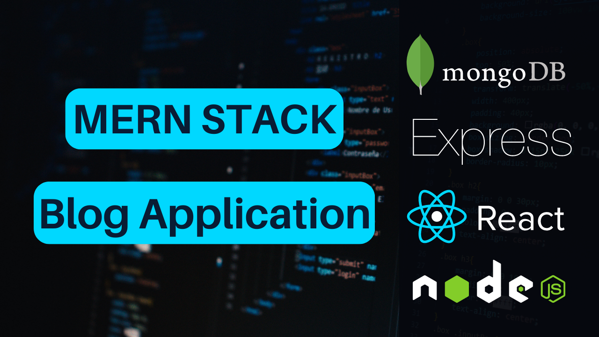

# blog-pro-MERN-stack
This repository is the client side and the server side of Blog Project built with MERN stack +redux toolkit



# Usage
- Install Mongo DB on your local machine or use Mongo DB Cloud -> [Go To MongoDB Website](https://www.mongodb.com)
- Create Cloudinary account for storing the images -> [Go To Cloudinary Website](https://cloudinary.com/)
- Create `images` folder in the backend

## Backend

### Used Technologies
- **Node.js**: Runtime environment for server-side JavaScript.
- **Express**: Minimalist web framework for Node.js to handle routes and middlewares.
- **cors**: Middleware to enable cross-origin requests.
- **dotenv**: Module to load environment variables from a `.env` file.
- **nodemon**: Development tool that automatically restarts the Node.js server upon file changes.
- **nodemailer**: Module to send emails from Node.js.
- **bcryptjs**: Library for hashing passwords.
- **cloudinary**: Service for managing cloud-based images and videos.
- **express-rate-limit**: Middleware for rate-limiting HTTP requests in Express applications.
- **helmet**: Middleware that helps secure Express apps by setting various HTTP headers.
- **hpp**: Middleware to protect against HTTP Parameter Pollution attacks in Express apps.
- **joi**: Powerful schema description language and data validator for JavaScript.
- **jsonwebtoken**: JSON Web Token implementation for node.js to generate and verify JWTs.
- **mongoose**: MongoDB object modeling tool designed to work in an asynchronous environment.
- **multer**: Node.js middleware for handling multipart/form-data, primarily used for uploading files.
- **xss-clean**: Middleware to sanitize user input by escaping HTML and preventing XSS attacks.

### Dependencies
```bash
npm install express cors dotenv nodemon nodemailer bcryptjs cloudinary express-rate-limit helmet hpp joi jsonwebtoken mongoose multer xss-clean

```

## Frontend (React)

### Used Technologies
- **axios**: Promise-based HTTP client for the browser and Node.js.
- **react-router-dom**: DOM bindings for React Router, enabling routing in React applications.
- **react-moment**: React component for the Moment.js library to format dates.
- **react-redux**: Official React bindings for Redux, a predictable state container for JavaScript apps.
- **react-scripts**: Configuration and scripts for Create React App.
- **react-toastify**: React component for toast notifications.
- **sweetalert**: JavaScript library to create beautiful and responsive alert dialogs.

### Dependencies
```bash
npm install axios react-router-dom react-moment react-redux react-scripts react-toastify sweetalert

```

## Environment Variables
Create `.env` file in the backend folder and add the following
```
PORT= 8000
MONGO_URI= your mongodb uri
NODE_ENV= development
JWT_SECRET= your jwt secret key
CLOUDINARY_CLOUD_NAME= your cloud name from cloudinary
CLOUDINARY_API_KEY= your api key from cloudinary
CLOUDINARY_API_SECRET= your api secret from cloudinary
APP_EMAIL_ADDRESS= your email service for sending email
APP_EMAIL_PASSWORD= your email service password
CLIENT_DOMAIN= http://localhost:3000 
```


## Install Dependencies
**backend**
```
cd backend
npm install
```
**frontend**
```
cd frontend
npm install
```


## Run
**Run the backend**
```
cd backend
npm run dev
```

**Run the frontend**
```
cd frontend
npm start
```
